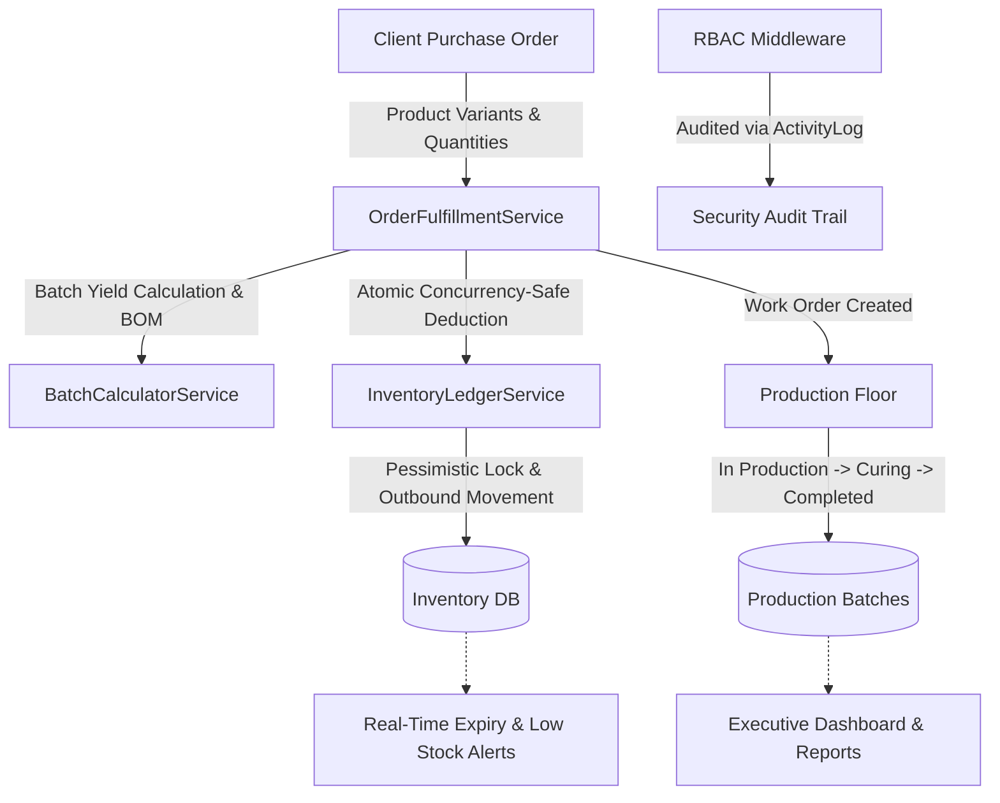

# 🧀 LactoFlow — Artisanal Cheese Production & Inventory ERP

[](https://laravel.com)
[](https://php.net)
[](https://mysql.com)
[](https://docker.com)
[](#automated-testing)

**LactoFlow** is an enterprise-grade Management Information System built for artisanal cheese manufacturers. It models domain-specific dairy operations—from milk yield calculations, batch sizing, aging/curing cycles, and multi-item purchase orders, to automated Bill of Materials (BOM) stock deductions and full audit trail logging.

---

## 🏗️ System Architecture & Data Flow



---

## 🌟 Key Technical Highlights

1. **Double-Entry Style Inventory Ledger (`InventoryLedgerService`):**
   * Implements an immutable `inventory_movements` ledger (`inbound` and `outbound`).
   * Eliminates concurrency race conditions using pessimistic database row locking (`lockForUpdate()`) wrapped in database transactions.

2. **Domain-Specific Batch Normalization & Splitting (`BatchCalculatorService`):**
   * Automatically normalizes cheese orders to standard artisanal batch sizes (1.25 kg to 22.5 kg increments).
   * Automatically splits large wholesale orders into discrete production batches and calculates variable milk/cream/salt ratios according to artisanal formulas.

3. **Bill of Materials (BOM) Recipe Engine:**
   * Dynamic recipe deduction per cheese type (Burrata, Stracciatella, Mozzarella, Provola, etc.) upon order confirmation, with transactional rollback if ingredient inventory is insufficient.

4. **Perishability & Aging Management:**
   * Tracks batch-level expiration dates on incoming ingredients (`expiry_date`) and flags expiring items on the executive dashboard.

5. **Role-Based Access Control (RBAC):**
   * Segregated permissions for **Admin**, **Production Lead**, **Inventory Manager**, and **Plant Manager** with audit logging on all critical data changes.

---

## 🚀 Quick Demo Accounts (1-Click Login Available)

For portfolio reviewers, the login screen includes **1-Click Demo Login** buttons:

| Role | Username | Password | Access Scope |
|---|---|---|---|
| 👑 **System Admin** | `admin` | `admin123` | Full administrative control, user management, system configs, audit logs |
| 🧀 **Production Lead** | `production` | `prod123` | Batch creation, curing lifecycle tracking, output logging |
| 📦 **Inventory Manager** | `inventory` | `inv123` | Raw material stock, inbound replenishment, purchase orders |
| 📊 **Plant Manager** | `manager` | `mgr123` | Analytics dashboard, production & inventory reports |

---

## 💻 Quickstart & Setup Guide

### Option A: Run via Docker (Recommended for instant testing)

```bash
# 1. Clone repository
git clone https://github.com/Nasz11/NaturasiMIS.git
cd NaturasiMIS

# 2. Start containers (PHP 8.2 + Apache + MySQL)
docker compose up -d

# 3. Setup application inside container
docker compose exec app composer install
docker compose exec app php artisan migrate --seed
docker compose exec app npm install
docker compose exec app npm run build

# Open http://localhost:8000 in your browser
```

---

### Option B: Local Setup (Native PHP/Composer)

#### Requirements: PHP 8.2+, Composer 2, Node.js 20+, MySQL/MariaDB

```bash
# 1. Clone repository
git clone https://github.com/Nasz11/NaturasiMIS.git
cd NaturasiMIS

# 2. Install dependencies
composer install
npm install

# 3. Environment configuration
cp .env.example .env
php artisan key:generate

# 4. Configure local DB in .env and run migrations with seed data
php artisan migrate:fresh --seed

# 5. Build assets & start server
npm run build
php artisan serve
```

---

## 🧪 Automated Testing

The project includes unit and feature test suites covering domain algorithms, transactional stock deductions, and RBAC authorization boundaries:

```bash
php artisan test
```

### Test Coverage Highlights:
* `Tests\Unit\BatchCalculatorServiceTest`: Batch normalization, multi-batch splitting, and yield lookup formulas.
* `Tests\Feature\OrderFulfillmentTest`: Order preview generation, atomic inventory deductions, stock insufficiency rollbacks, and cancellation inventory restorations.
* `Tests\Feature\RolePermissionTest`: RBAC boundary checks ensuring floor workers cannot access user settings or audit logs.

---

## 📁 Clean Code Directory Layout

```text
app/
├── Http/
│   ├── Controllers/         # Thin HTTP controllers
│   ├── Middleware/          # CheckRole, CheckPermission RBAC
│   └── Requests/            # Form request validation classes
├── Models/                  # Eloquent models with SoftDeletes
└── Services/                # Isolated Domain Services
    ├── BatchCalculatorService.php    # Batch splitting & formula engine
    ├── InventoryLedgerService.php    # Concurrency-safe ledger movements
    └── OrderFulfillmentService.php   # Order preview & BOM deduction coordinator
database/
├── migrations/              # 24 chronological schema migrations
└── seeders/                 # Realistic artisanal production demo data
resources/views/             # Modular Blade templates (Tailwind / CSS)
tests/                       # Unit and Feature automated tests
```

---

## 📜 License
This project is open-source software licensed under the [MIT license](LICENSE).
